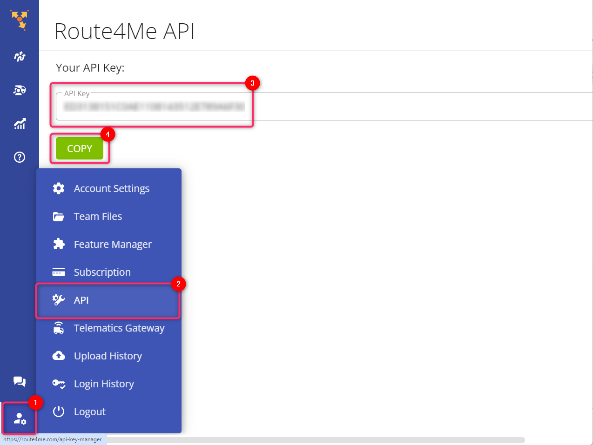

# How to Get Started

This section introduces the basic concepts of the Route4Me API and explains how to get an API key, make API requests, and handle responses.

## Authentication <a href="#authentication" id="authentication"></a>

To use the Route4Me API, you need a Route4Me account and a unique API key.

Alternatively, you can use the demo API key `11111111111111111111111111111111` to test and optimize routes using a predefined list of coordinates.

## Getting the API Key

1. Sign in to your Route4Me.com account.
2. Select **My Account > API**. Alternatively, go to the following link: \
   [**https://route4me.com/api-key-manager**](https://route4me.com/api-key-manager)
3. On the **Route4Me API** screen, click **Copy** to copy your API Key.

<figure><figcaption><p>Getting the Route4Me account API key</p></figcaption></figure>

## Making Requests <a href="#making-requests" id="making-requests"></a>

You can use any HTTP client or library to make API requests, such as curl, Postman, or HttpClient.&#x20;

You can also use the [**Route4Me SDKs**](sdks.md), which simplify the integration by wrapping the API calls and responses in native code.

### Requirements for API Requests

* Make all requests over HTTPS.
* Include your API key as a query parameter in every request. For example:


```url
https://api.route4me.com/api.v4/address_book.php?api_key=11111111111111111111111111111111&addr_id=4623361,6281217
```


* A `GET` or `DELETE` request must provide the parameter values in the URL’s query string and should be URL-encoded.
* A `PUT` or `POST` request must have a JSON-encoded body and provide the `Content-Type: application/json` value as its header.

### Supported HTTP Verbs

<table data-full-width="false"><thead><tr><th width="157">Verb</th><th>Action</th></tr></thead><tbody><tr><td>GET</td><td>Retrieve resources</td></tr><tr><td>PUT</td><td>Update resources</td></tr><tr><td>POST</td><td>Create resources</td></tr><tr><td>DELETE</td><td>Delete resources</td></tr></tbody></table>

## Handling API Responses <a href="#responses" id="responses"></a>

Most of the Route4Me API responses are JSON-encoded. Few of the responses are XML-encoded.

As a rule, a response contains:

* A Boolean success flag — `true` if the API call was successful.
* A message — `Success` if the API call was successful, or an error message otherwise.
* A response — the data returned by the API call.

## An Example Request

Below is an authenticated request to the `Routes` endpoint. It will mark an address as visited.



Mark an address with specified `route_id` as visited.



Your API key



Route ID\




Address ID



1 means the address was visited



Member ID



```json
{"status": "true"}
```



### cURL Call Example

Here is how you might call this method via `curl (cmd)`:

```
@ECHO OFF

SET url=https://api.route4me.com/actions/address/update_address_visited.php
SET apikey=11111111111111111111111111111111
SET routeid=5C15E83A4BE005BCD1537955D28D51D7
SET addressid=160940135
SET isvisited=1 
:: isvisited=1 means the address was visited, isvisited=0 means it wasn't
SET member=1

ECHO ON

curl -o file1.txt -g -k -X PUT "%URL%?api_key=%apikey%&route_id=%routeid%&address_id=%addressid%&is_visited=%isvisited%&member=%member%"

timeout /t 30 
```
